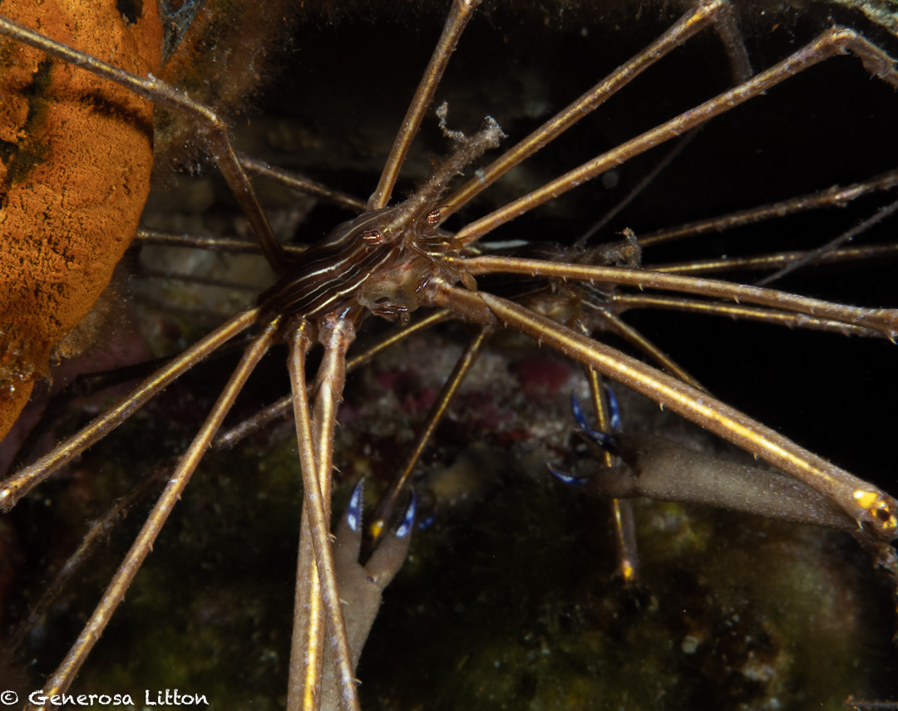

I lost the lens cap to my macro port at the Scuba Club Cozumel house reef so I decided to do a last dive during the afternoon of June 2 in search for this item. I knew it was close to impossible to find it but hey, why not give it a try? You never know, right? :stuck_out_tongue_winking_eye:

I retraced my steps and couldn't help but photograph more blennies!

After searching for about 30 minutes, I gave up and decided to just continue exploring. I went to the left side of the reef and got to the bottom of the main buoy and lo and behold, I noticed some arrow crabs mating! :open_mouth:

I learned that during mating, the male arrow crab holds the female against his belly to deposit a sperm packet into the female crab.

The dance lasted about five minutes, so quite efficient, eh?

I also got a close up of a grey angel fish and also saw some juveniles but they moved so fast, that I couldn't get a good shot.

Heading back to shore, I spotted a fireworm which, if touched, produces a painful burning sensation. :scream:

Look but don't touch por favor!

More blennie pics and other house reef critters <a href="https://generosalitton.smugmug.com/ArrowCrab-Mating/" target="\_blank">here.</a>

It was a lovely time in Cozumel and I'll sureley be back! :wave:
