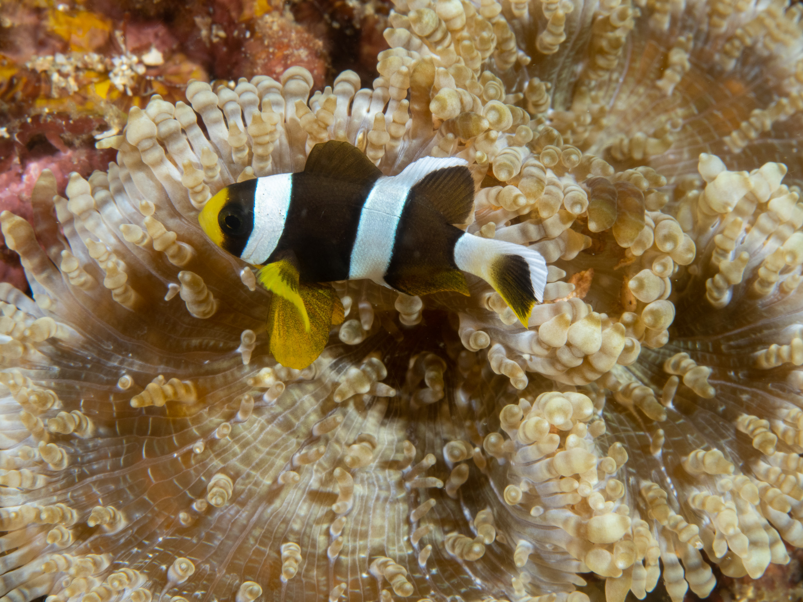

I learned that all clownfish are born male and then become female when the male's partner dies. Thus, Nemo's father, Marlin, should've turned into a female, Marlina. Don't you think?

You likely have seen clownfish swimming inside anemones. I learned that they have a very symbiotic relationship wherein the clownfish provides the anemone nutrients in the form of waste while also scaring off potential predator fish. In return, the anemone provides the clownfish with protection and shelter.

`youtube: https://youtu.be/yfCMP_YVjyI`

We should all be like clownfish and anemones, helping each other get the best of living in this world!

Last set of pics from my Anilao dive trip <a href="https://adobe.ly/3UPDOsj" target="_blank">here</a>

I'll be heading back to Puerto Morelos, Mexico for Thanksgiving with friends 🦃, hasta luego! :wave:
