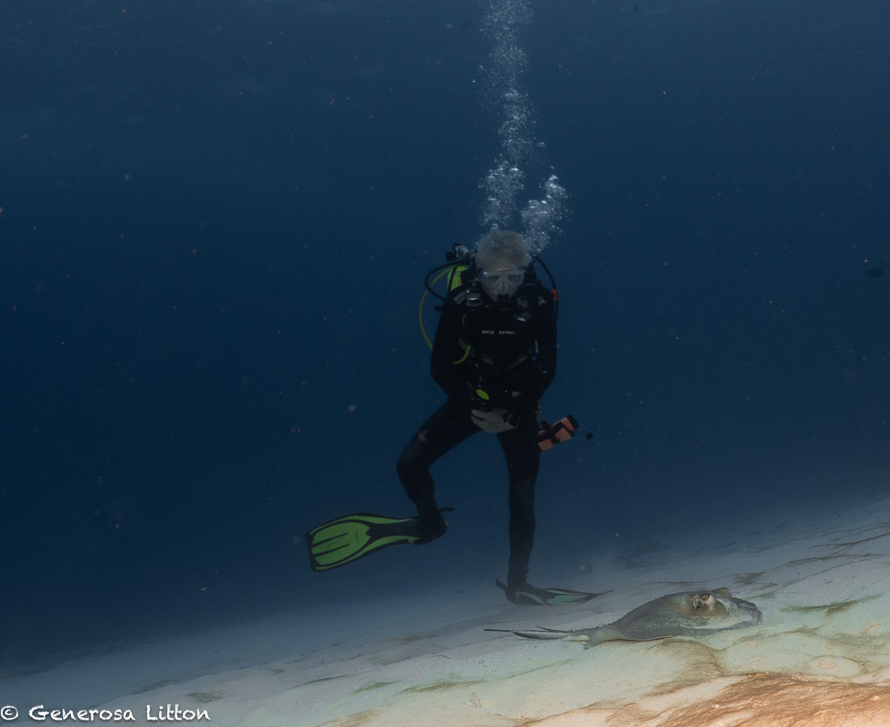

Cozumel is known for its large coral head formations and deep walls. I decided to head back there and stay at the Scuba Club Cozumel as I find it is the place that offers the best "bang for your buck". :money_mouth:

I love the house reef and all the various critters that you can find. More on that in a later blog.

The first two days, I got to dive Palancar Bricks, Yucab, Columbria Bricks, and Tormentos. I learned that Cozumel closes some of its sites (such as Palancar Caves and Gardens) for two months in order to "give things a rest". I felt that this was a good thing. :thumbsup: :clap:

At Palancar Bricks, which is part of the large Palancar reef system, we enjoyed swimming through various coral formations which are always breathtaking, even if I've seen the for the hundreth time.

The Yucab reef is more of a flat reef with smaller corals. It has portions of sandy and grassy bottom especially at the end which meant lots of rays!

Whoops, don't step on me!

At Columbria Bricks, there were lots of large coral formations again and this time, my dive buddies, John, Mike, and Wayne, wanted me to take photos of them which I gladly obliged!

Wayne also shared with me that he often practices removing his mask underwater, so why not take a photo sans mask?

Tormentos offered lots of cool fish and various critters.

We spotted this small hawskbill turtle heading to a coral for breakfast.

I got lucky that I was able to get a shot up close and personal.

Check out more <a href="https://generosalitton.smugmug.com/Cozumel-PalancarColumbiaBricks/" target="_blank">photos of the Cozumel sea life</a> of Palancar Bricks, Yucab, Columbria Bricks and Tormentos.

Looking forward to more Cozumel diving! :eyes:
