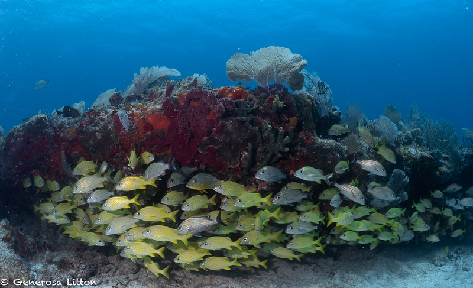
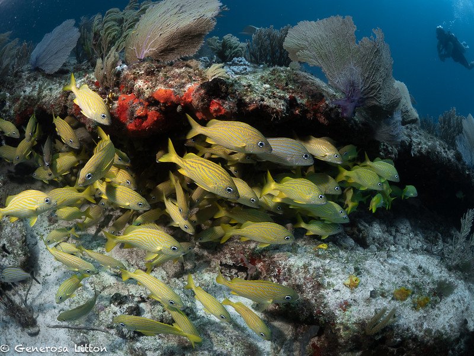
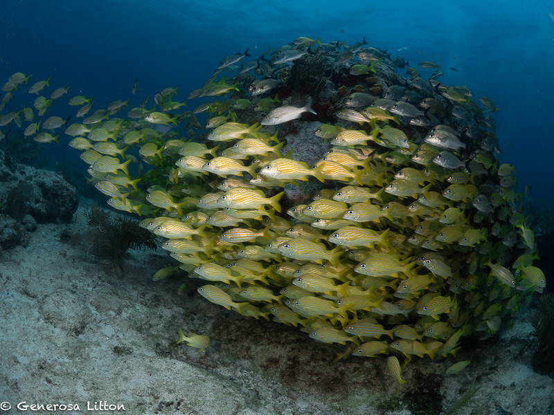
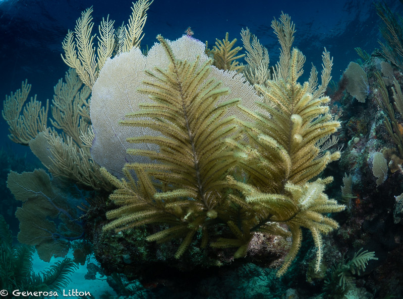
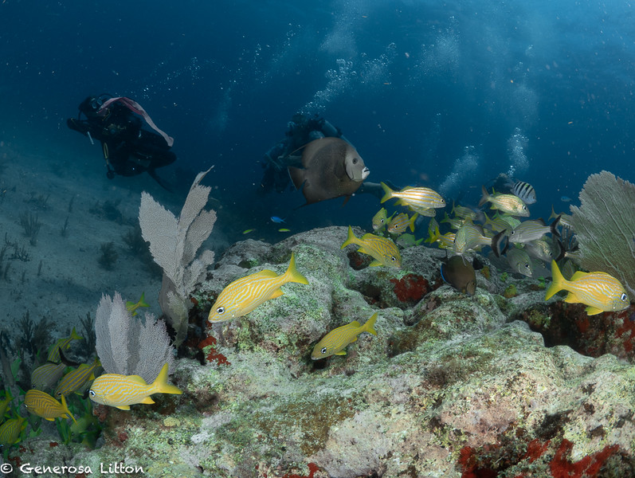

When diving in the Carribean especially in Puerto Morelos, you will likely see a variet of french grunts whose scientific name is Haemulon flavolineatum. One of my favorite dive sights to capture these guys is called "Fish Market."

As you can see in the various photos below, it's easy to see how the site got its name.

Fish Market is literally swarming with large schools of french grunts who got their name from the sound that they make when grinding their teeth. You will notice that most of them are yellow with either silver stripes or silver with yellow stripes. It is quite fun swimming through them as they are very comfortable with divers being around them.

You will also enjoy various soft corals and occasional angel fish, seargent major and blue tang (Dory!) swimming amongst the grunts.

I also dove another site called "Lobster Garden" where you can see pics of ... you guessed it ... lobster! I took just a few and more of the corals. Check out the rest of my photos <a href="https://generosalitton.smugmug.com/LobsterGarden-FishMarket-052023/" target="_blank">here</a>.

The season is starting to slow down here in Puerto Morelos, Mexico and the temperature is getting a bit hot for my taste. I'll be heading back to San Francisco for the summer where it's going to be cold and foggy!

Hasta luego! :wave:
