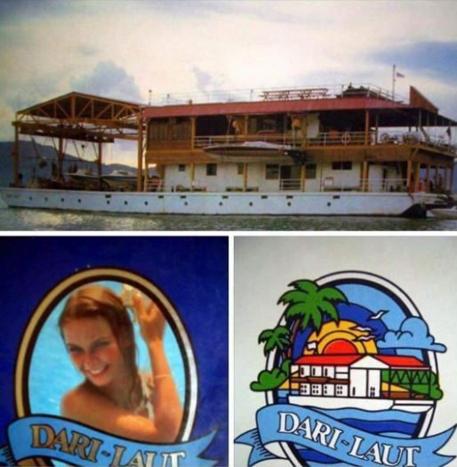

The morning of Nov. 9 brought me to a familiar dive site, the Dari Laut. This site's main attraction is what once was a floating casino that caught fire and sunk in the early 1980s. The name originated from Dari (the owner of the casino) and Laut (out in the sea). Locals believe that the casino was purposely burned as it wasn't making enough money. The owners collected insurance from the fire.

Source: Unknown, n.d.

I remember diving this site in the mid-80s. It was a popular one, usually there wasn't any current. I vividly recall seeing an upside down toilet :smile:. inside the wreck.

Today, just the frame of the boat remains however, the site has many nudibranchs and other creatures and most of all, there was no current!

What I enjoyed seeing were crab-eyed gobies (aka twin-spot or two-spot goby based on the spots on their bodies).

.

What's so cool about them is that their fins are round shaped with some blue spots, it looks like they are wearing big round shoes :smile:

.

I had the pleasure of watching them do what seems like they were cleaning up their house! :astonished:

`youtube: https://youtu.be/lMqvquaTRwY`

Overall it was a great dive! :clap:
