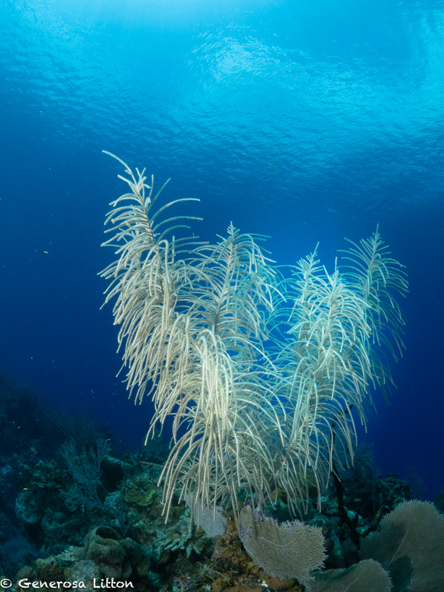

Wide angle photography has always been a challenge for me so I decided to join <a href="https://www.backscatter.com/" target="_blank">Backscatter's</a> Wide Angle Underwater Photography bootcamp in Little Cayman where Jim Decker, CEO of Backscatter (check out some of his articles <a href="https://www.scubadiving.com/authors/jim-decker-ceo-backscatter-underwater-video-and-photo" target="_blank">here</a>) and Erin Quigley of <a href="https://www.goaskerin.com/">goaskerin.com</a> taught us underwater photography techniques and post production sorcery :smiling_imp: using Lightroom and Photoshop.

I never dove Little Cayman but wow, I was very impressed! The scuba diving is similar to Cozumel but without the tourists, cruise ships and current! The reefs were much healthier and we got to experience the famous Bloody Bay Wall, got up close and personal with stingrays, turtles, and groupers, and also got the chance to photograph the various barrel sponges and soft corals.

For the photgraphy, I use an Olympus OMD EM1-MarkIII camera, a Panasonic fisheye lens, and 2 Sea and Sea YSD2 strobes.

To summarize what I've learned, here are steps to getting the best wide angle shots.

1.  Initial settings: shutter speed of 125, aperture of f8 and ISO of 200.
2.  Take some test shots with out the strobes on, aim at the direction you plan to photograph. Check the blue on your histogram. It should be mostly to the left. Getting the blues right is the most important first step.
    If the blues are to the right, step up the aperture to f11 or increase your shutter speed or even reduce the ISO. Once you get the blues to the left half of your histogram you'll come out with shots like these:

3. Take test shots this time with your strobe. Where should you position your strobe? Checkout <a href="https://www.scubadiving.com/strobe-position-tips-underwater-photography" target="_blank">this article</a> by Jim Decker where he discusses strobe placement. In short, keep your strobes up, aim it at the subject. Seems obvious, eh? :smile:. Check your histogram and look for overblown sections, this means that your strobes are too strong so dial it down. Once you get your settings, your ready to go!

4. Lastly, get up close then **FOCUS, FRAME, FIRE**!

It took me a few days to get the hang of it, and sometimes the image just didn't make it so I turned some of them to black and white like this stingray shot.

But my awesome buddy Deb Stewart, took some shots of me including me chatting it up with Señorita Tortuga while our two friends in the back are deciding what site to check out next :laughing:.

Photo by: Deb Stewart

The groupers were aplenty and often very friendly so getting up close wasn't a problem.

<a href="https://generosalitton.smugmug.com/Little-Cayman-March-2023/" target="_blank">Here's more</a> of my favorite shots of the sea life in Little Caymen. I'll be back! :wave:
