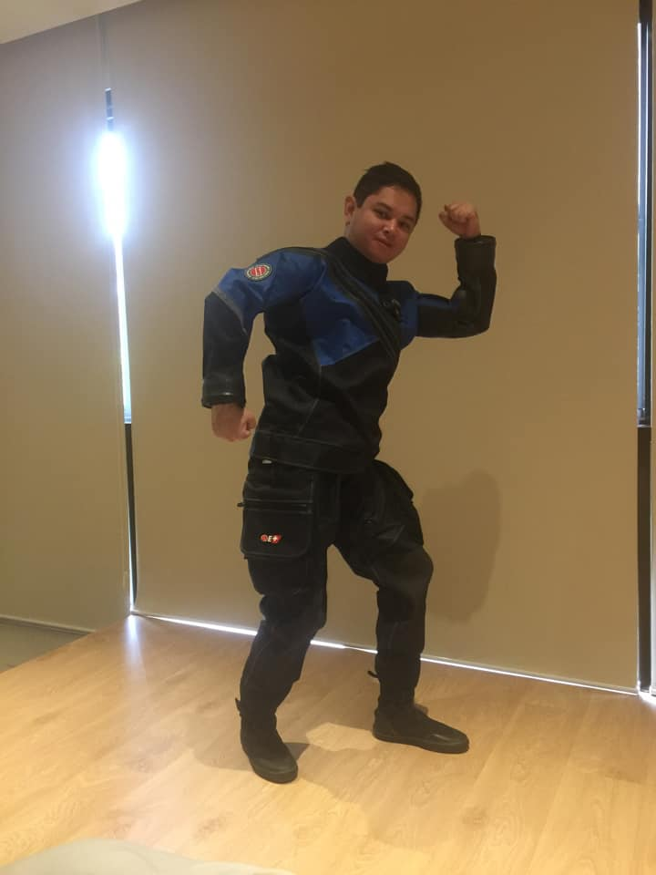
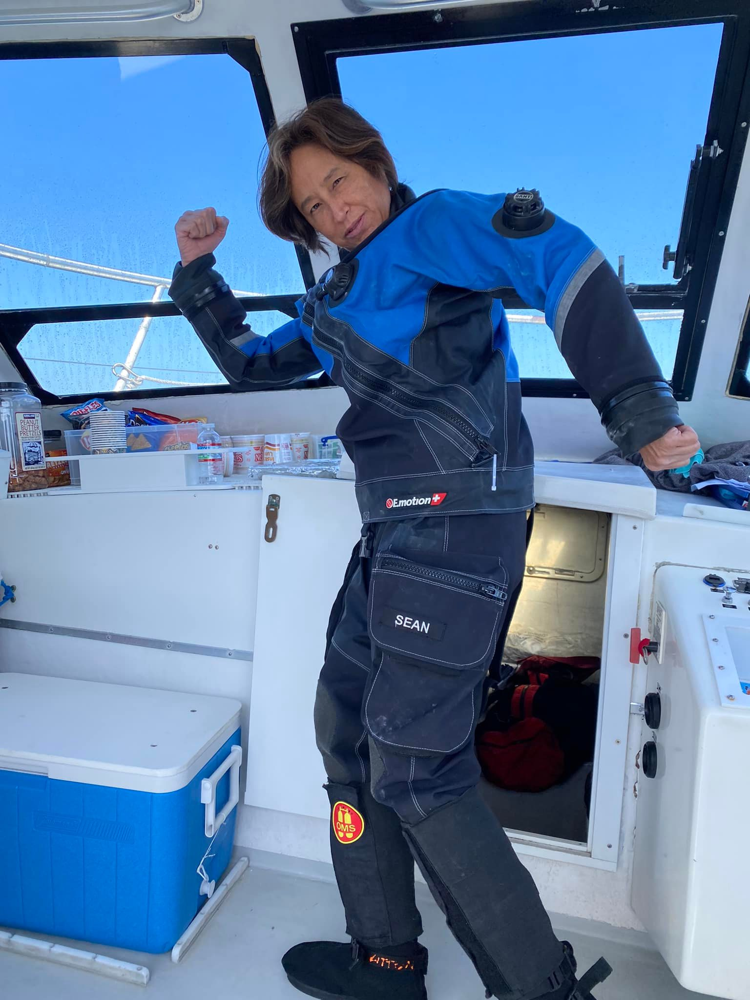

You either love scuba diving in Monterey or hate it. It took me a while to get to the "love it" stage but I'm there! So whenever I get a chance to dive Monterey, I do it.

It is common to have visibility in the 10 feet to 30 feet range. Most of the time the viz is what we call "pea soup" greenish at the top but then it can open up to 30+ feet viz in the bottom.

I recently dove in May using my late nephew's drysuit which he modeled below.

I had the boots changed to fit my feet as well as have the arms and legs shorted and finally added new neck and wrist seals. The suit fit comfortably although still a bit big in the chest. More importantly it kept me warm and dry!

Heading out, the water was a bit choppy and thus we didn't head out very far. We ended up diving Metridium Mountain where you'd see a lot of metridiums which are sea anemones that look like cauliflower and Macabee Pinnacle.

I always enjoyed diving these sites where I got to see the usual suspects but my favorites include the tree fish which is a black and yellow striped fish with red lips and a male sheephead.

Check out the video which I shot using the new GoPro Hero 10. As you can see, the vizibil
`youtube: https://www.youtube.com/watch?v=kaQX25tvclQ`

Enjoy :wave:!
