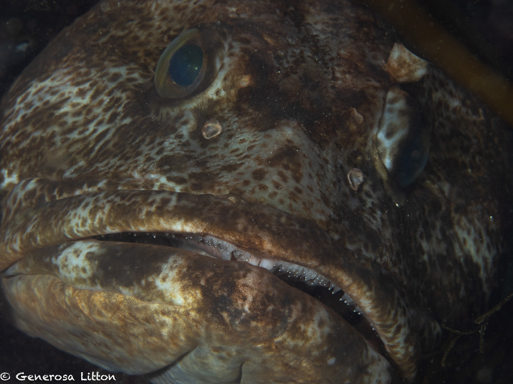
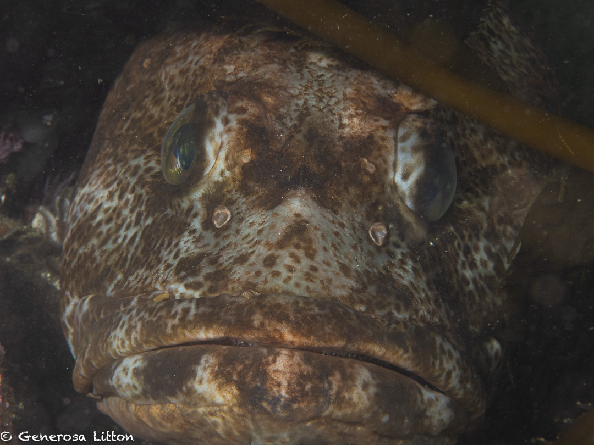
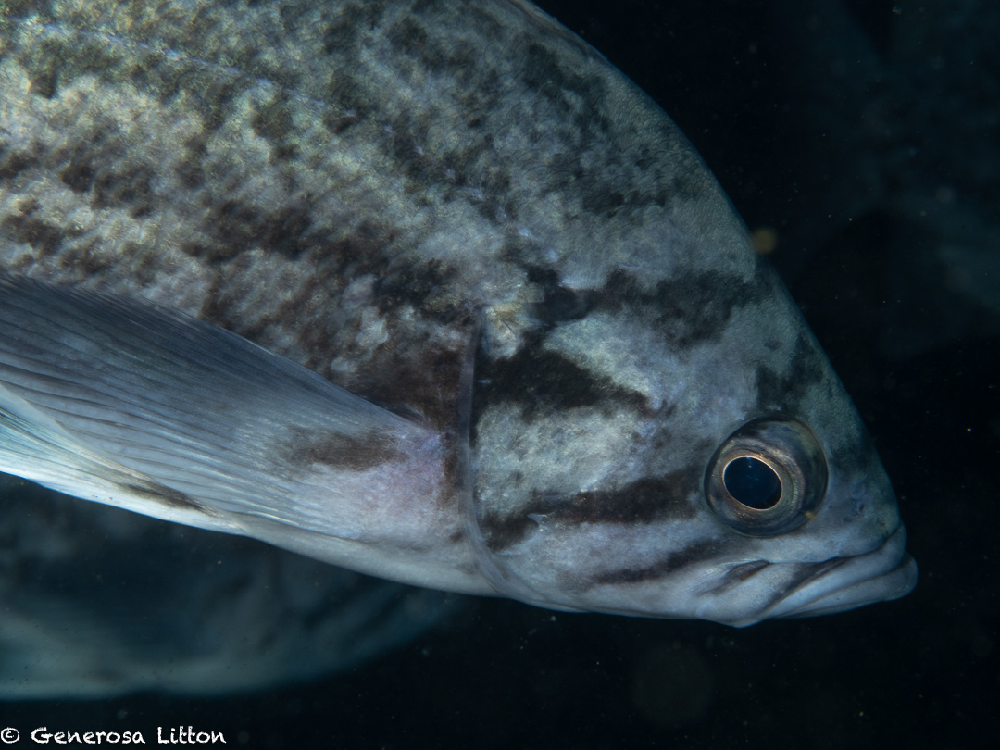
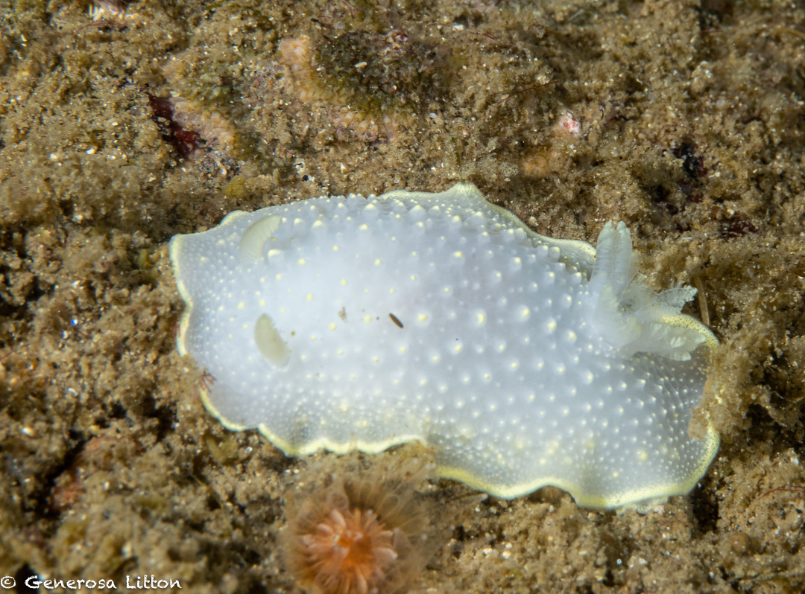

I'm back in the San Francisco Bay Area and decided to visit Monterey and do some cold water diving. Typically, you'd be lucky to get 15 feet visibility diving in July in Monterey. This time, I was very lucky as we got 30 feet at Metridium mountain and a good 20 feet at Macabee pinaccle.

I recently got the Olympus 90mm macro lens and although it was pricy (plus I had to get the Nauticam port for it), it didn't disappoint. The clarity was amazing!

Here are shots of a 5 foot lingcod (yes it was huge) with me about a foot away from it. It's amazing how the 2x magnification of the lens made it seem like I was a few inches away from it.

I was also thrilled to see a school of rockfish and I got a shot of one of them and the clarity of its face stripes was such a delight!

Here's a shot of a common nudibranch called the Horned Dorid. 

The highlight for me was seeing not one, not two, but three fringeheads!

More about them in my next blog :grin: which you can read <a href="https://www.glcodeworks.com/blog/sarcastic_fringehead/" target="_blank">here</a>
