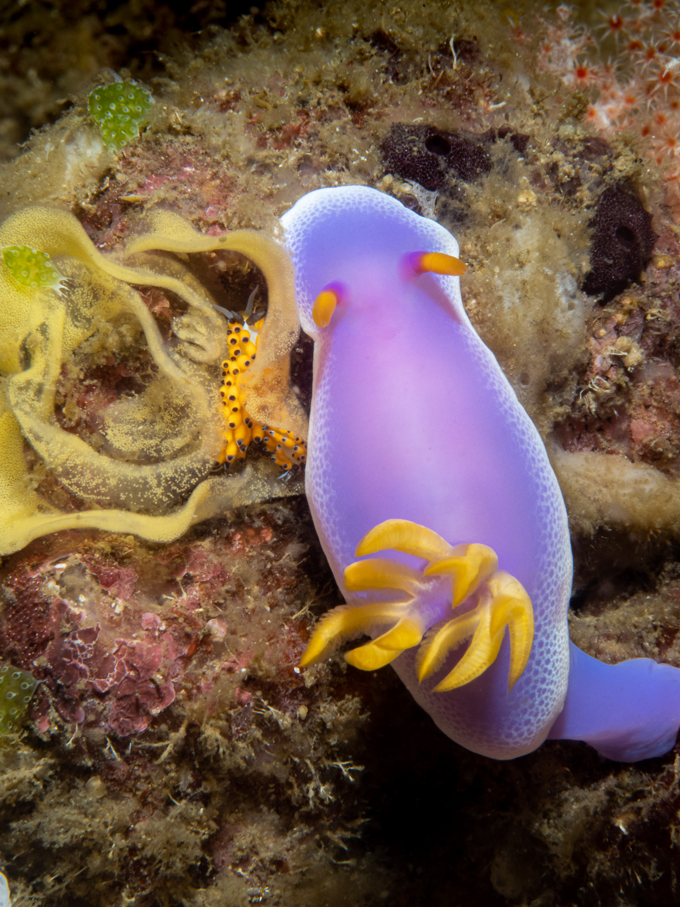
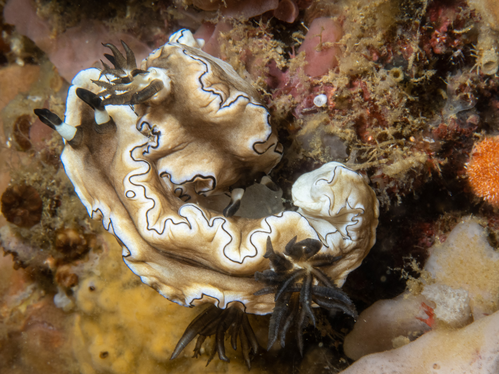
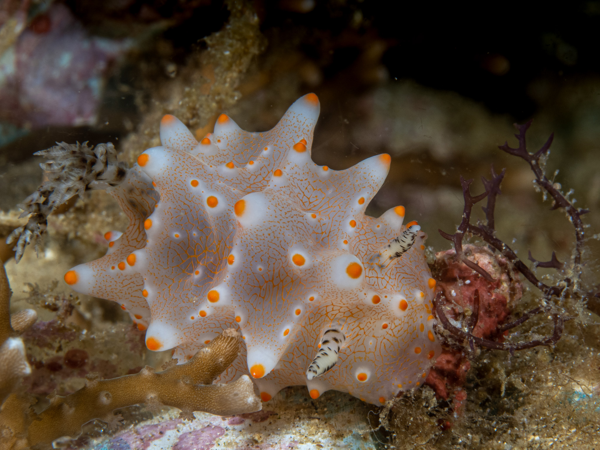
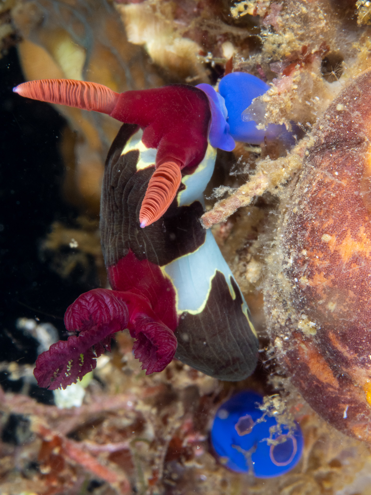
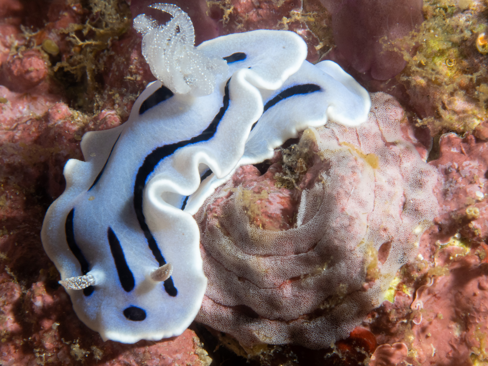
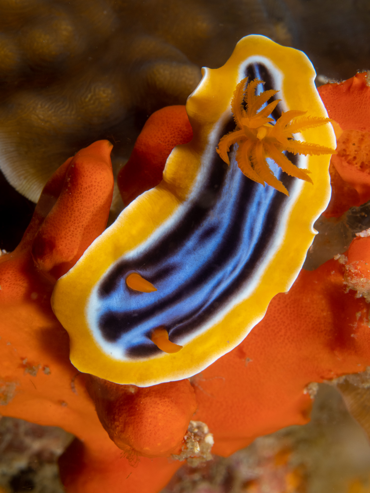

Scuba diving Anilao brings back childhood memories. It would take at least four hours to drive from Manila to Anilao Batangas due to the terrible road conditions. Back then (early 80s) there were not many dive resorts. I remember sleeping on the beach after diving. Today, rows of resorts front the ocean and driving to Anilao can be done in two hours.

Many of my American scuba diving photographer friends have raved about staying at Crystal Blue Resort home of the famous underwater photographer, Mike Bartick. So I checked it out. The verdict? It's an eat, sleep, dive, take photos, repeat sort of place; you definitely get the best bang for your peso, so it was perfect. :smile:

Anilao is really a macro photographer's playground; it's known as the nudibranch capital of the world housing over <a href="http://www.nudibranch.org/Philippine%20Sea%20Slugs/html/philippine-nudibranchs.html" target="_blank">100 species</a>. Nudibranchs (aka as nudies) are a group of soft-bodied marine gastropod molluscs which shed their shells after their larval stage (source: <a href="https://en.wikipedia.org/wiki/Nudibranch" target="_blank">Wikipedia</a>)

10 Nudibranch Basics (source: [It's Dive O'Clock Somewhere](https://www.diveoclock.com/destinations/Asia/Philippines/Anilao_nudibranchs/))

1. A nudibranch is a mollusk (soft-bodied invertebrates) without a shell (when adult).
2. Nudibranch means naked gill, from the Latin words nudus and branchia.
3. There are about 3000 nudibranch species at shallow-water and a few at deep-water.
4. Nudibranch are hermaphrodites (male and female reproductive organs).
5. They lay their eggs in ribbons (flower-like) with protective mucus that take about one week to hatch.
6. Nudibranchs can live up to one year.
7. Some nudibranchs can grow larger than 50cm / 20 inch, while others are smaller than your eyes can see
8. Nudibranch are carnivores; many eat sponges, corals, anemones and other nudibranchs.
9. The stunning colors come from the food they eat and some can also store some toxins from their prey.
10. These bright colors and impressive patterns are for camouflage (blend in) and defense (not eatable).

Here are pictures of some nudies including their interesting behavior.

Hypselodoris apolegma, notice the small nudibranch inside the egg, eating parts of it.

Cool to see mating Doriprismatica sibogae

I couldn't find this nudibranch's scientific name, anyone know?

Nembrotha chamberlaini, which was a bit difficult to photograph because of the black color.

Mating and egg laying Chromodoris willani.

Chromodoris elisabethina, I got lucky with the orange background.

More pictures of cool nudibranchs are <a href="https://adobe.ly/3WLsn6y" target="_blank">here</a>.

Thanks for looking and hope you enjoyed the pictures! :wave:
