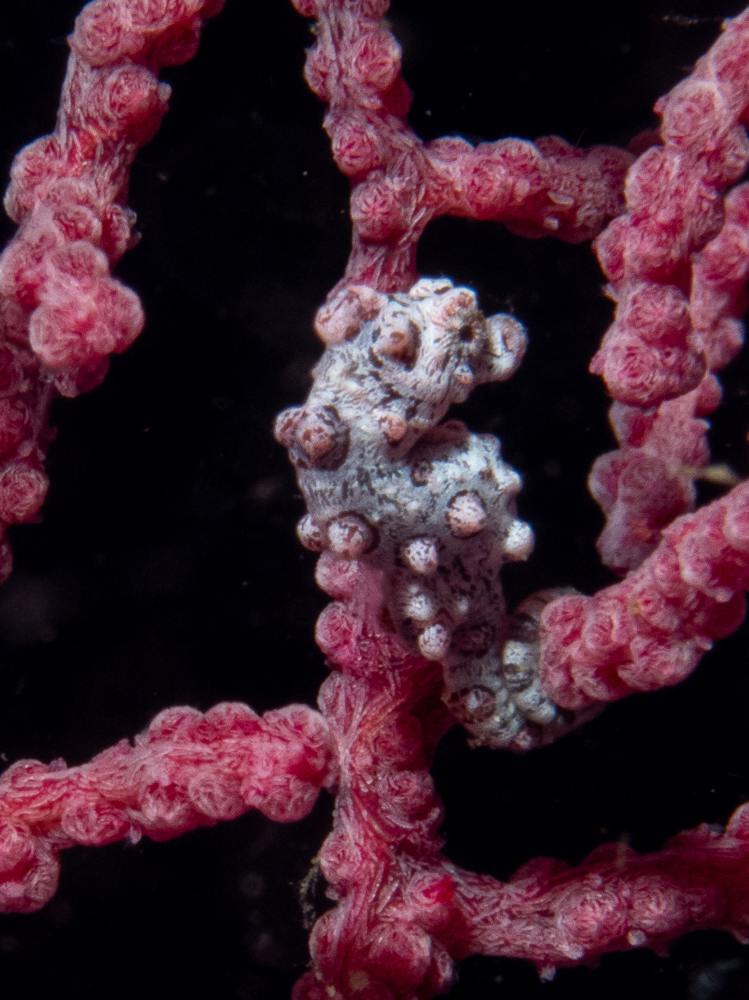
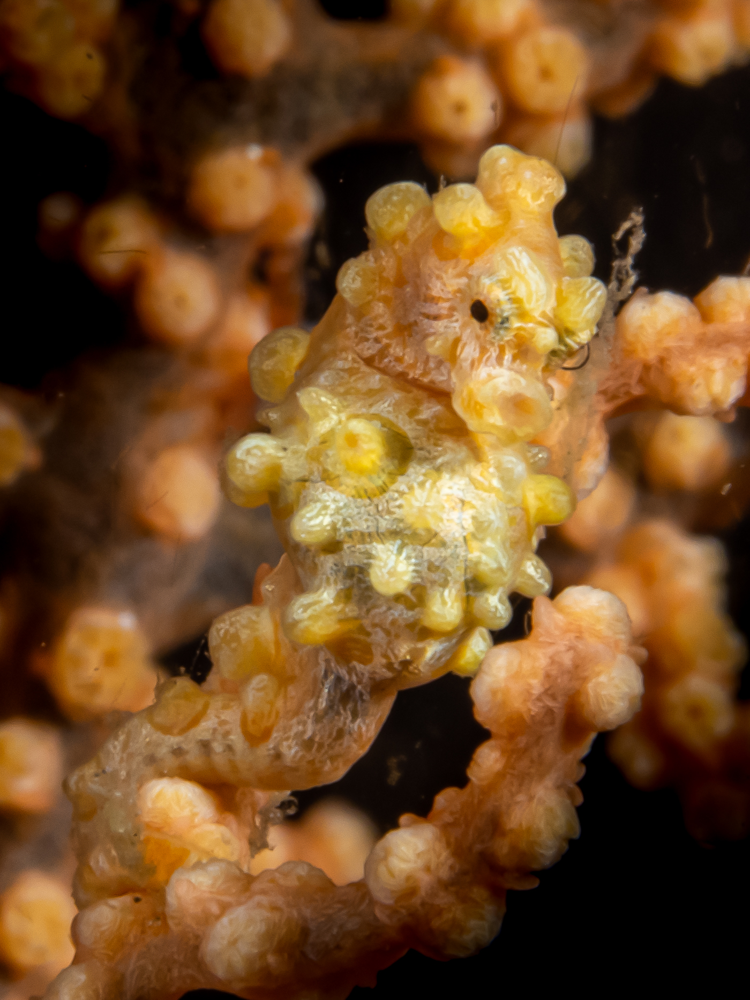

One of the little animals that you are guaranteed to see (especially if you have a good spotter) when diving in Anilao is the pygmy seahorse or the Hippocampus Bargibanti. During this dive trip, I saw two varieties. The typical gray/light purple with the pink bumps (they are called tubercles) which I saw at the dive site Kirby's Rock and also at Koala.

And a yellow one which we saw at the dive site Old Bethlehem. The Hippocampus Denise, also known as Denise's pygmy seahorse or the yellow pygmy seahorse is a wee bit bigger than the other one. I was able to spot this variety with my own eyes, although I did have a macro lens so it was much easier! 🔎

.

For perspective, check out the size of the pygmy seahorse as compared to the pointy stick used by my spotter dive master.

Some fun facts about pygmy seahorses (source: <a href="https://oceana.org/marine-life/pygmy-seahorse/" target="_blank">oceana.org</a>):

1. Bargibant’s pygmy seahorses live between 52.5 to 131 feet (16-40 m) deep.
2. Bargibant’s pygmy seahorses grow to a maximum length 0.94 inches (2.4 cm).
3. Bargibant’s pygmy seahorses take the color of whichever species of gorgonian corals they live on.
4. Unlike other seahorses, male pygmy seahorses use a pouch in their trunk – not their tail – to brood their young.
5. The Bargibant’s pygmy seahorse was discovered accidentally in 1969 on a gorgonian coral being examined and was the first pygmy seahorse species to be discovered.

More pictures from the dives I did this day are <a href="https://adobe.ly/3UEN56u" target="_blank">here</a>.

Thank you to divemaster Edgar from <a href="https://www.divecbr.com/" target="_blank">Crystal Blue Resort</a> for being the best spotter!

Hasta luego :wave:
