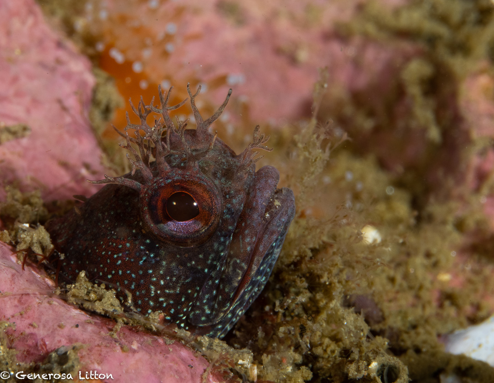
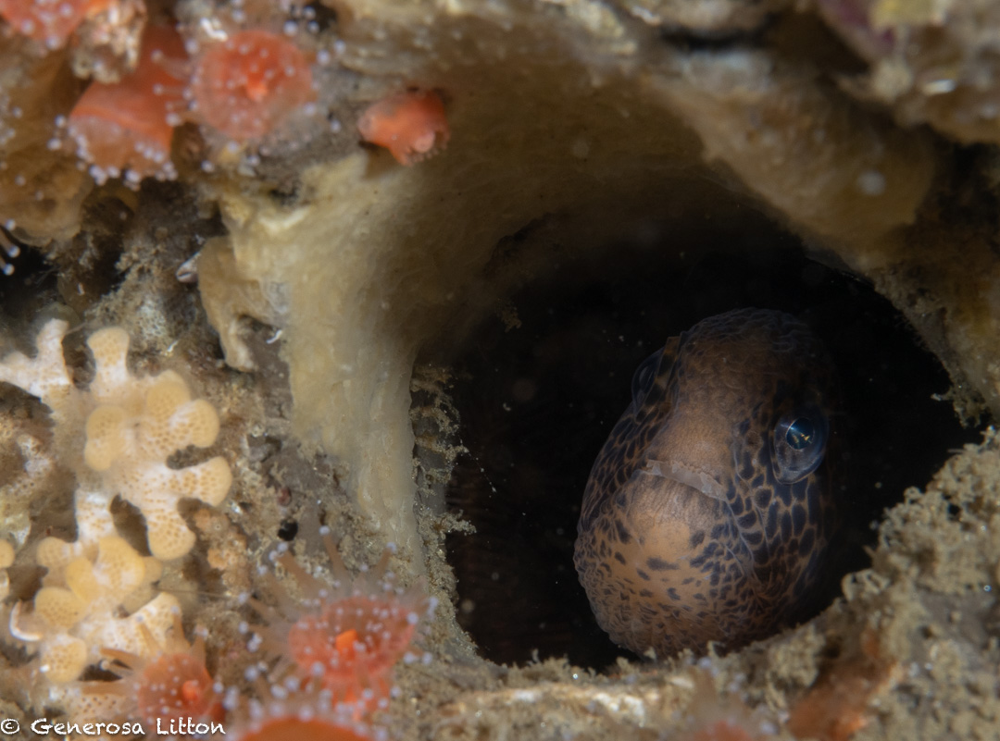
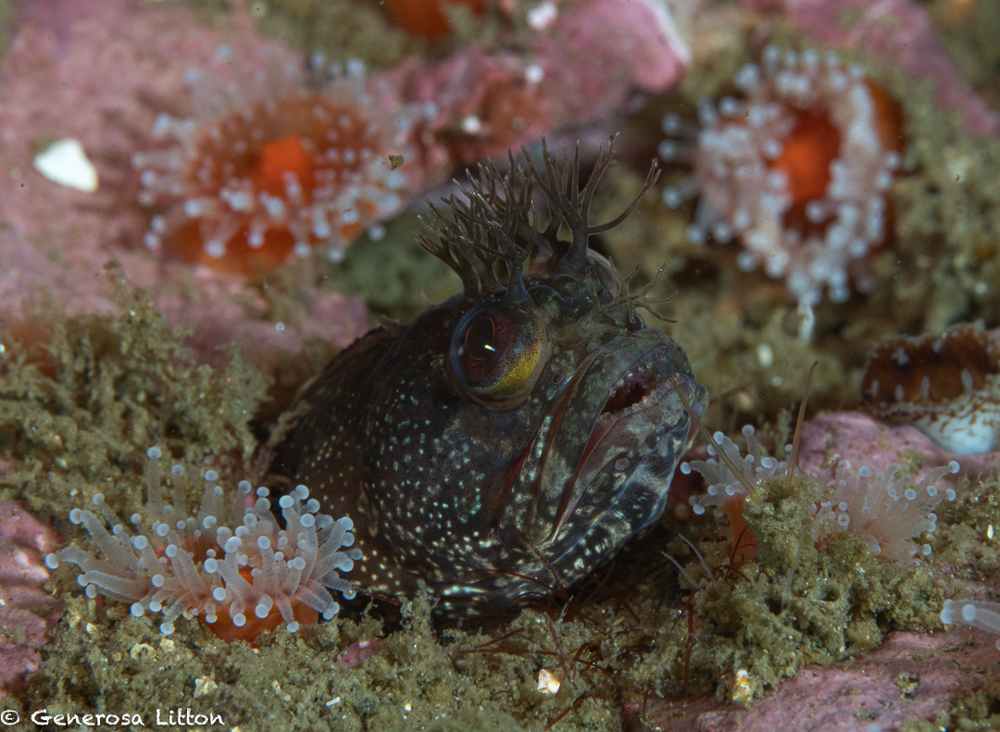

I did a dive off the Beachhopper II in July 2023 and the conditions were a bit bumpy so we didn't head out far from Monterey Bay. One of my favorite dive sites is one called Shale Island which to my understanding was formed during the 1989 Loma Prieta earthquake. It is a raised plateau or what I'd like to describe as a giant round table approximately 400ft long and 120ft wide. Under the table top, you will find lots of small critters. <a href="https://cadivingnews.com/dive-spots/island-isnt-montereys-shale-island/" target="_blank">Here's</a> a great description of the dive site from California Diving magazine.

I usually dive this site in a clockwise direction then turn around once I hit a sunken anchor covered with strawberry anemones.

This time, I ventured to the left or counter-clockwise where we spotted not one, not two, but three fringeheads! :scream:

These species are known as the sarcastic fringehead due to their territorial temperament and the decorative "branches" above their eyes.

I also spotted a baby wolf eel hiding inside its hole and I couldn't get enough of her.

So cute! :heart_eyes:

My dive buddy also spotted a sleeping octopus but alas, I couldn't get a shot cause I ran out of battery! The 90mm lens consumes more juice due to the autofocus action so I need to figure out how to get my subjects in focus more efficiently.

Here's more <a href="https://generosalitton.smugmug.com/MontereyFringeheads/" target="_blank">fringehead photos</a>.

What do you think of these sarcastic dudes? :smiling_imp:

Do you think the name is apropos? :question: Would love to read your comments!

Will be doing another dive in late July, excited to keep taking pictures with my 90mm lens! :boom:
