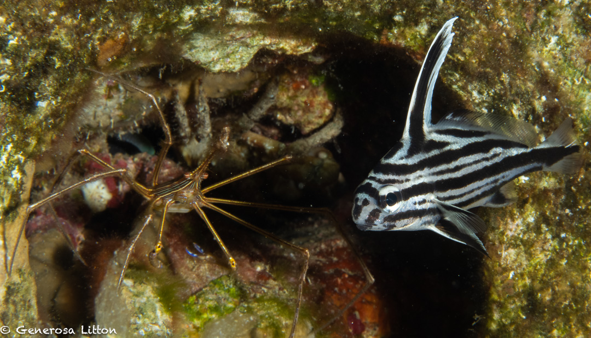
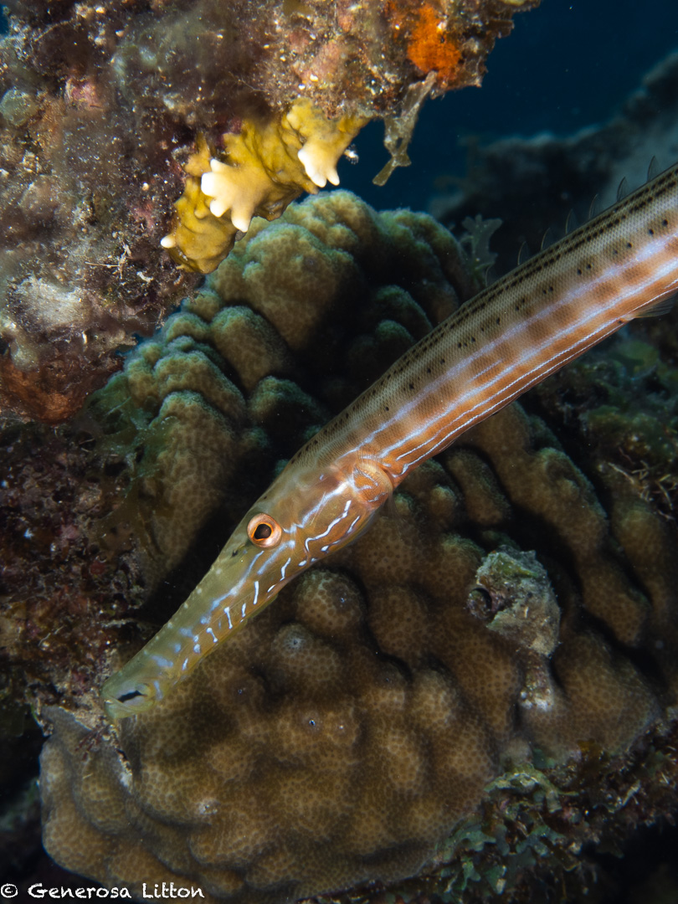
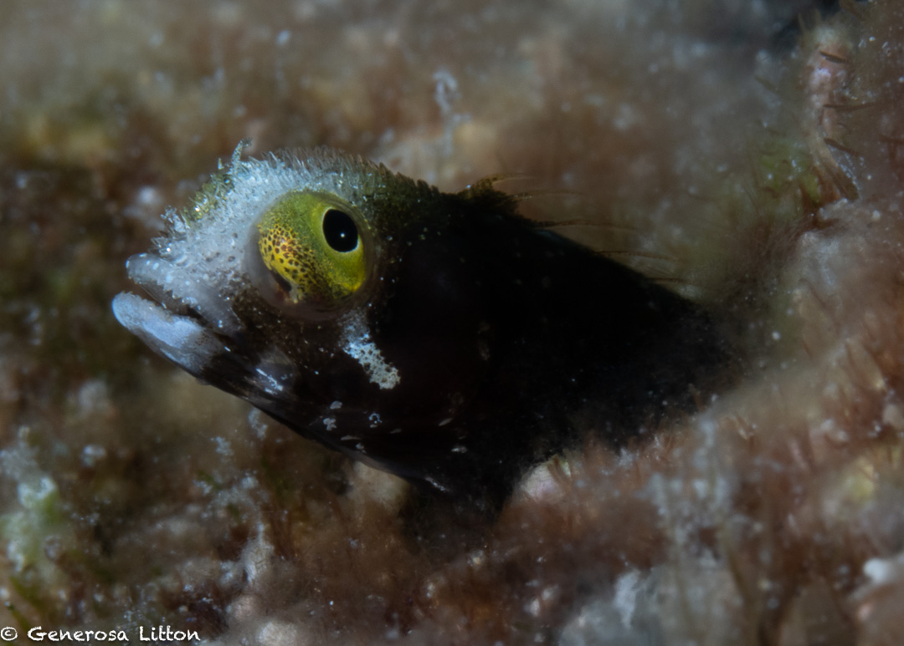
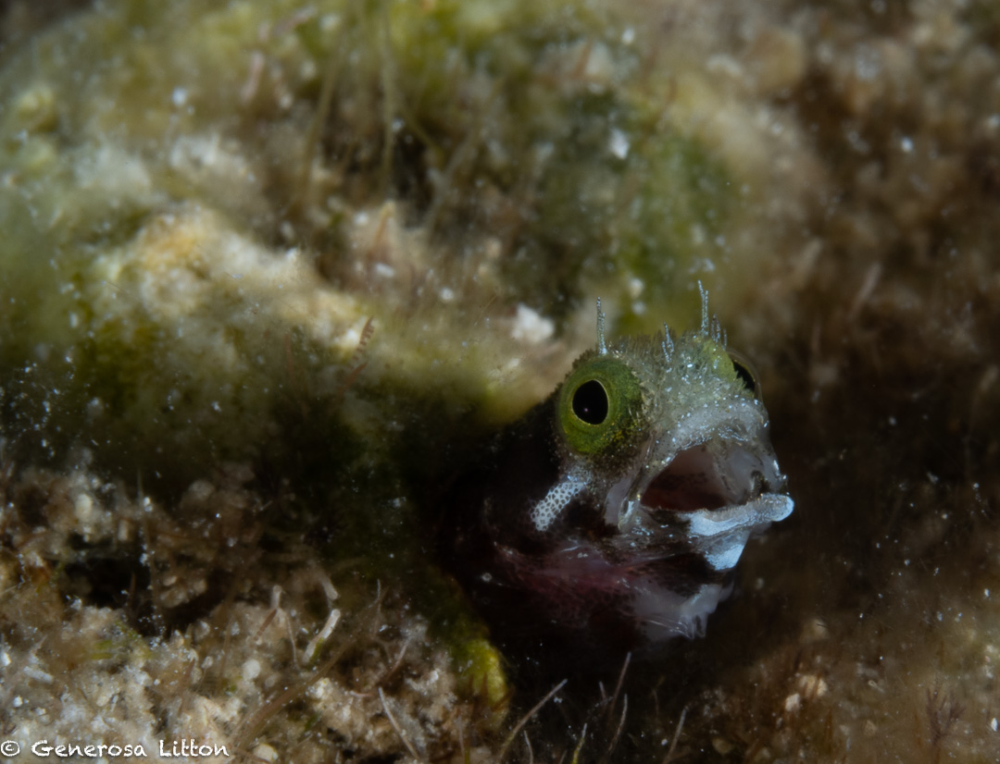
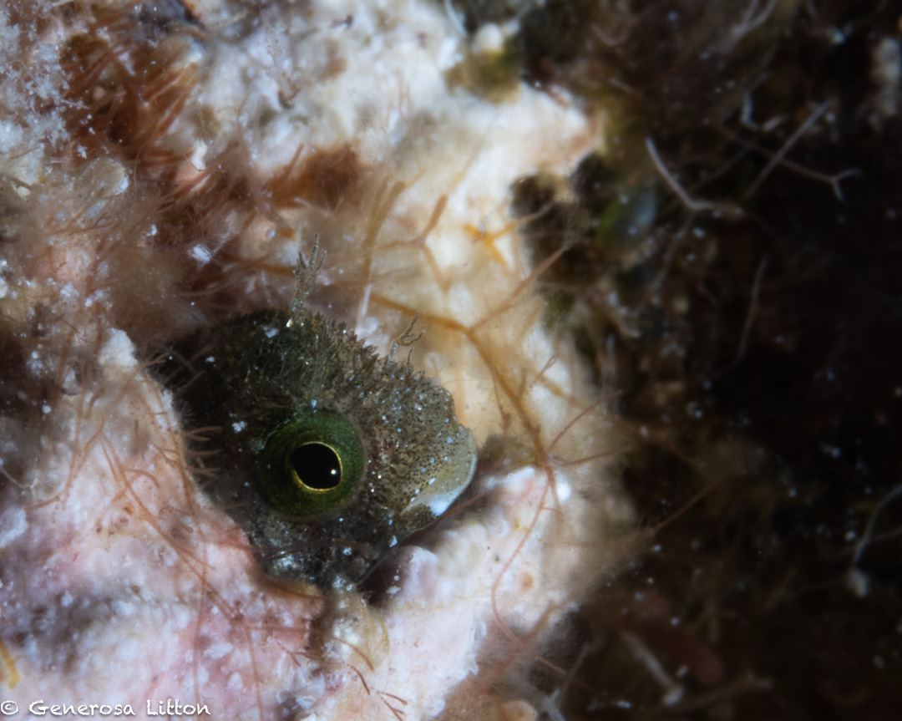

Ever since I got to know the cuteness of the caribbean blenny (thanks to my dive buddy Linda Elliot :clap:), I've been hunting for them everytime I get my feet wet in the Caribbean waters. :ocean:

The Scuba Club Cozumel house reef has so many of them that it was so cool to be able to see a number of them at one time. :fire:

I did an afternoon dive and took a heading of 320 degrees from the shore staircase, swam to the end of the right-hand side buoy and dropped down to 20 feet. Note that my wife, Leslie, was watching me the whole time. Normally, I would never dive alone :exclamation:

Below the buoy marker is a sunken pier which looked like it was damaged from a hurricane:question:

The structure is now an artificial reef teeming with all the usual Caribbean critters.

Best buddies: The highhat fish (not a drum, as I originally thought) and arrow crab

Trumpet fish

However, I had one mission, photograph the cute blennies! :boom:

The house reef did not disappoint. I had more than 50 shots and it was very difficult to narrow them down. Here are a few of my favorites :heart_eyes:

This shot made me think that this blenny was crying, oh no!

This blenny was trying to scream at me to get off her lawn!

This is one shy blennie.

More house reef critters photos <a href="https://generosalitton.smugmug.com/ScuaClubHouseReef-SeaCritters-Blennies/" target="_blank">here.</a>

Hasta luego! :wave:
