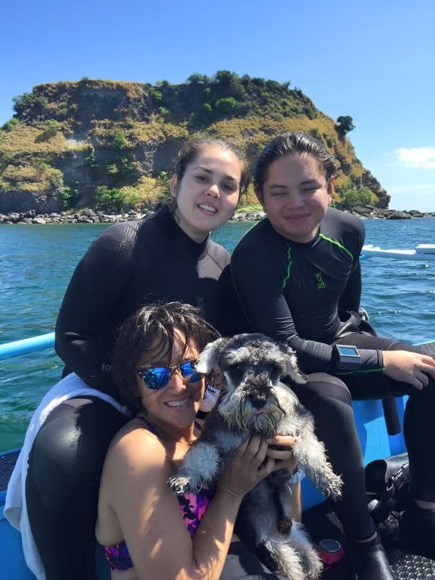

It has been a year since Sean passed away last Nov. 6, 2021. To commemorate Sean's life and our love for him, we planned a dive memorial where in we would dive his favorite spot in Anilao Batangas: Batoc to Beatrice. Anilao brings me lots of fond memories; I learned how to scuba dive there way back in the early 80s.

.

Both family and friends spent the weekend at the lovely <a href="https://solitude.world/about-solitude-acacia/" target="_blank">Solitude Acacia Hotel.</a>

We had a great time telling our favorite Sean memories. One thing everyone had in common to say about Sean was that he was a very good guy.
  

 

On the dive day itself, Nov. 6, 2022, we took a 25 minute boatride to Sombrero Island
and anchored at our desired dive spot which is called Batoc which is Tagalog for the "back of the neck." It was the starting point where we decenda and it was located behind Sombrero Island.

`youtube: https://youtube.com/shorts/LhDCmt5rY6s`
 

Sombrero is a Tagalog word (and a Spanish one too) for hat as you can see with the island's shape.
 

 

I was with Sean, his girlfriend Gabbie, and his first shnauzer Milo, in this same dive site back in February 2015.

Prior to spreading Sean's ashes, my sister Jenny, gave a very beautiful speech stating how we all loved and missed Sean, thanked everybody for spending the time to be at the event, and that although the price of love is grief, we would do it all over again.
`youtube: https://youtube.com/shorts/A4T-IHjfODQ`

The dive site usually has some current but not this time; the conditions were perfect! No current at all going from Batoc to Beatrice. The highlight for me was this very shy yellowish frogfish. I spotted it swimming to this wall and it was challenging to get a shot of her but I managed.

Additional photos are <a href="https://adobe.ly/3hiDHae" target="_blank">here</a>

I'm hanging out doing more dives the next few days so I'll be posting more photos. Stay tuned! 🤿
