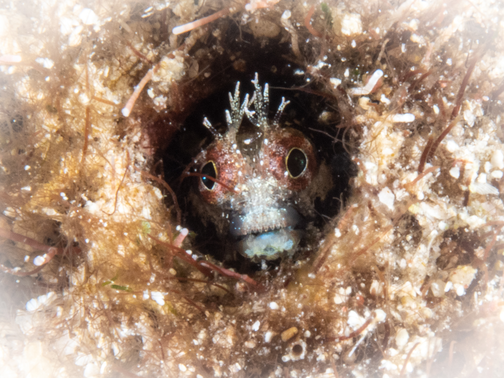
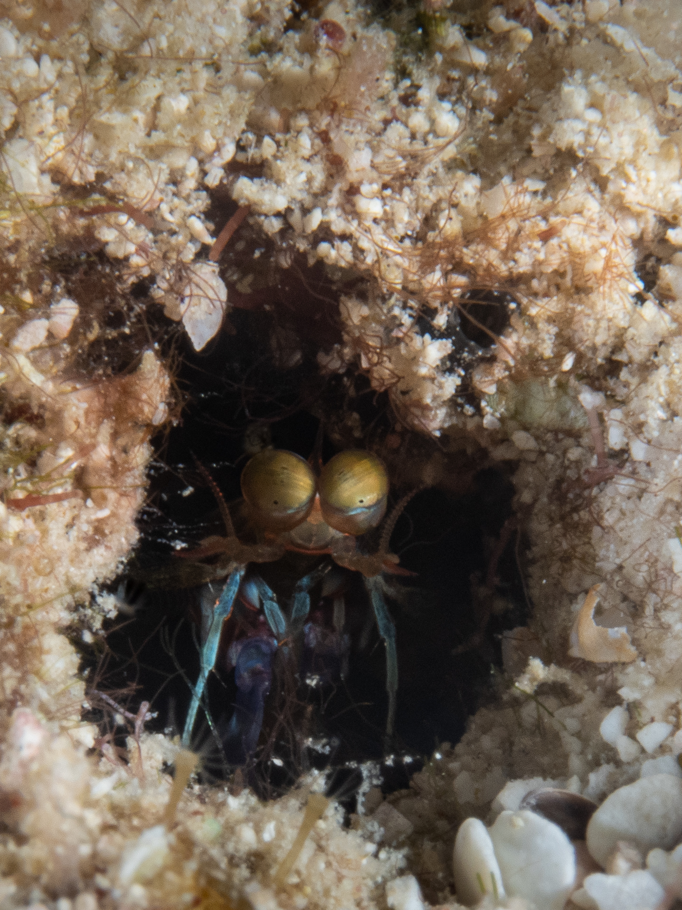

There are so many tiny things in the ocean that are so fun to look for. My favorite are blennies which are small fishes that are so easy to miss but once you find and see them through a macro lens, you'd be so happy to see their cute little face!

They tend to blend with the coral so patience is a virtule! These shy little guys and gals tend to hide in their sponge homes and come out with their head exposed.

Once you see movement, you have to be patient and wait for them to stick their heads out a bit more as they are curious little critters.  

I also spotted what I think is a mantis shrimp. This one in particular was so tiny that I couldn't see it clearly so wasn't sure what it was until I got to editing.

I also saw this other blue shrimp whose name is unknown 

Other not so tiny things that are emblematic of the Caribbean include the flamingo tongue slug

and the Christmas tree worm 

Lastly, I got to see some interesting kissing fish behavior which is actually a sign of territorial fighting.  

So nice to be back in the Caribbean!
