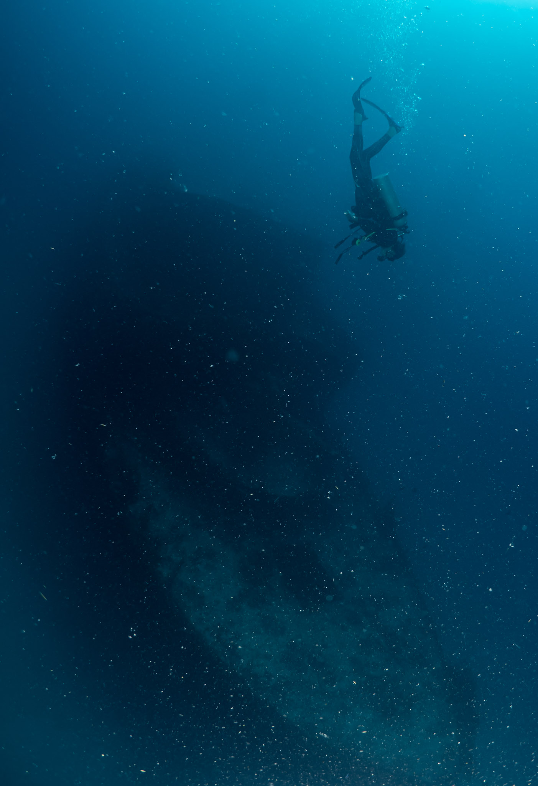
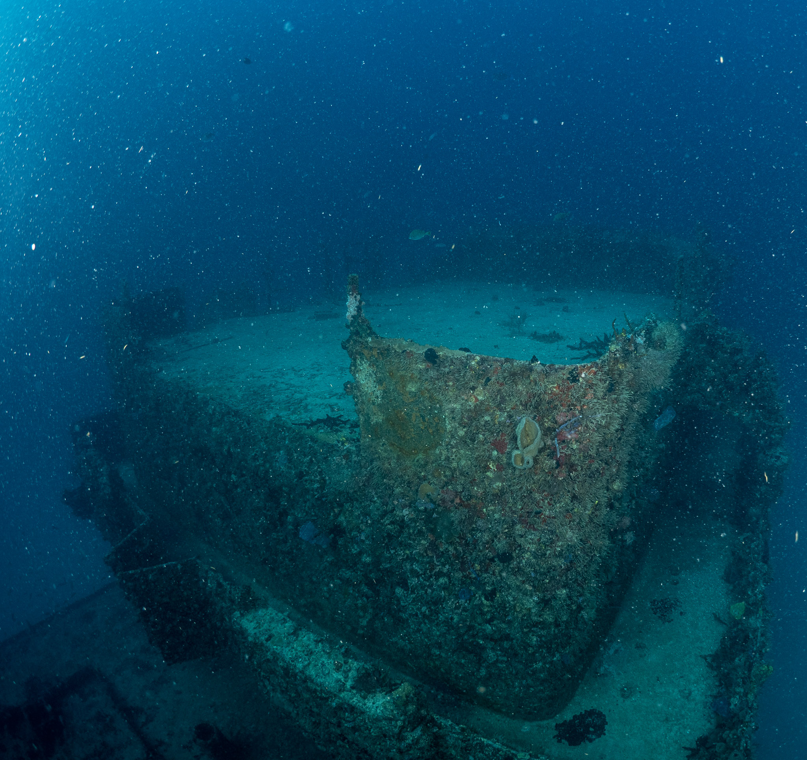
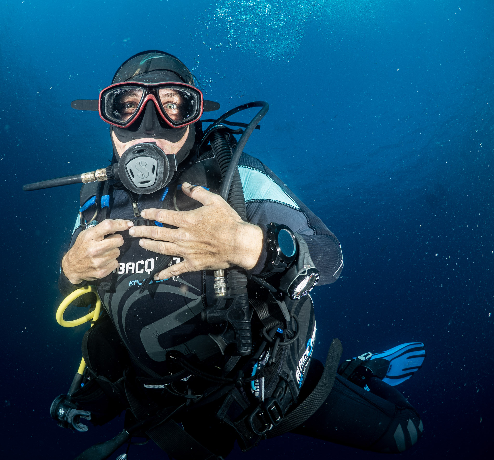
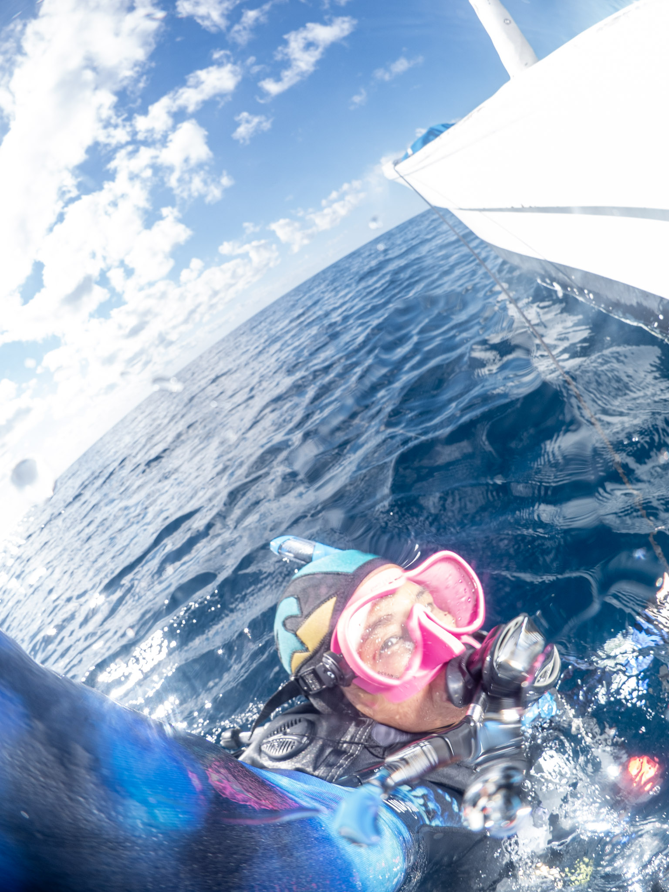

I love diving the C-56 in Puerto Morelos as I still have yet to take a good wreck shot. I think these shots were a bit better but not yet National Geographic ready!

This time I focused more on getting shots with people in it.  :smile:

Thanks to my dive buddies for allowing me to take photos of them!

Plus the boat captain, Mr. Rana, accidently took a shot of me which I thought was so cool!

Here's the rest of the <a href="https://adobe.ly/3tAhSXI" target="_blank">pics</a> of my January wreck dive with <a href="https://omdelfin.com/" target="_blank">OmDelfin</a>

Hasta luego :wave:!
